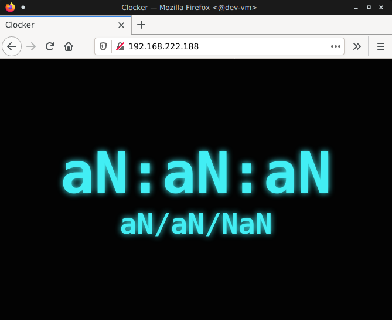
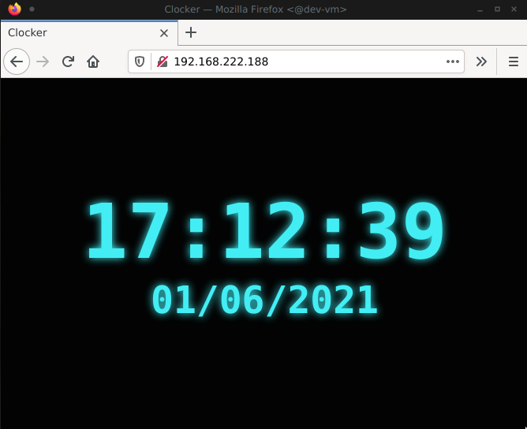

## Immfly Infra Test

The goal of this test is to deploy a simple "clock" web application (frontend + backend) in a virtual machine using `ansible`.

### Assets provided

- `debian10-ssh.img.tar.xz`: Compressed disk image of a virtual machine. This can be [downloaded from this link](https://immfly-infra-technical-test.s3-eu-west-1.amazonaws.com/debian10-ssh.img.tar.xz)
- `vm.xml`: Virtual machine XML definition for `libvirt`
- `rsa`: Authorized RSA key for accessing the virtual machine
- `index.html`: Frontend clock application

**Note about the VM**:

- The virtual machine operating system is a Debian 10 with `openssh-server` and `python3` installed.
- It will try to configure it's network interface via `DHCP`.
- In order to boot the virtual machine, configure the domain file `${PATH_TO_VM_DISK_FILE}` at `assets/vm.xml` with the location where the virtual machine image was extracted.

~~~xml
    <disk type='file' device='disk'>
      <driver name='qemu' type='raw'/>
      <source file='${PATH_TO_VM_DISK_FILE}'/>  <!-- change this -->
      <backingStore/>
      <target dev='vda' bus='virtio'/>
      <alias name='virtio-disk0'/>
      <address type='pci' domain='0x0000' bus='0x04' slot='0x00' function='0x0'/>
    </disk>
~~~

### Frontend application

Frontend is periodically calling at `/clock` endpoint (`HTTP GET` at port `80`) to gather timestamp information from a backend that doesn't exists yet.

### Backend application

Backend should be responding at path `/clock` and returning a unix timestamp like:

~~~py
>>> import time
>>> print(time.time())
1622556914.9101567
~~~

## Requirements

- Implement backend service (using any language/tech you love... or hate)
- Use ansible to deploy frontend and backend services inside the virtual machine.

If everything works, that is how it should look when accessing the virtual machine at port `80`:

## Extra points

- Proper ansible project structure
- Use docker to run ansible
- Use ssh-agent inside ansible container
- Run frontend and backend services using docker
- Backend application configurable using environment variables
- Don't run services as root
- Configure & deploy **EVERYTHING** using a single command, i.e: bash script

## Deliverables

- A git repository with an ansible project, the backend application and all other scripts you needed.
- Documentation explaining:
  - How to setup the VM
  - How to run the playbooks
- Feedback: please, don't hesitate to write any thoughts you have about this test.

Send the repository url to `ezequiel.biavaschi@immfly.com`
